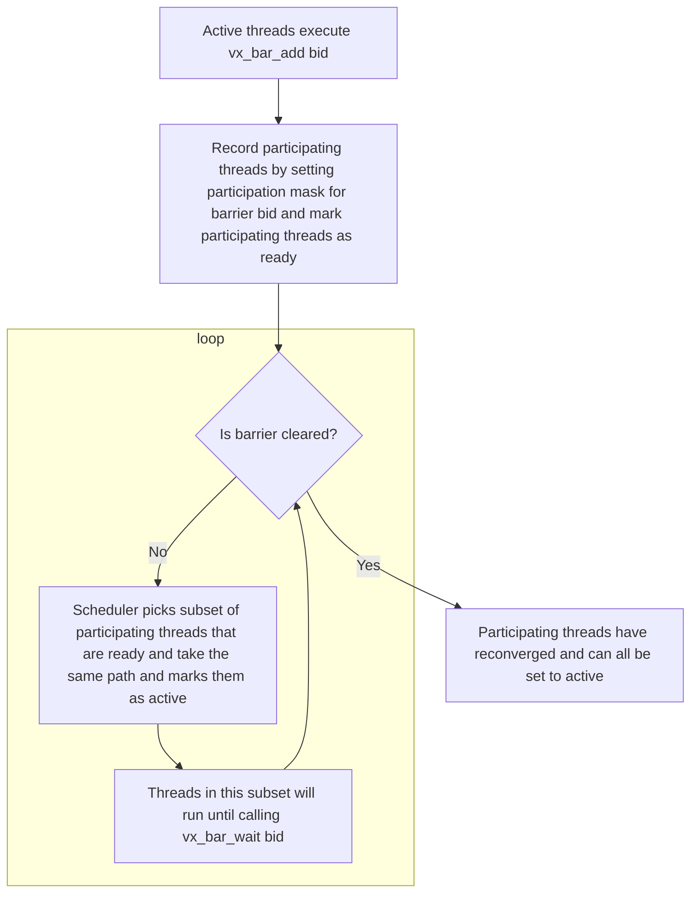
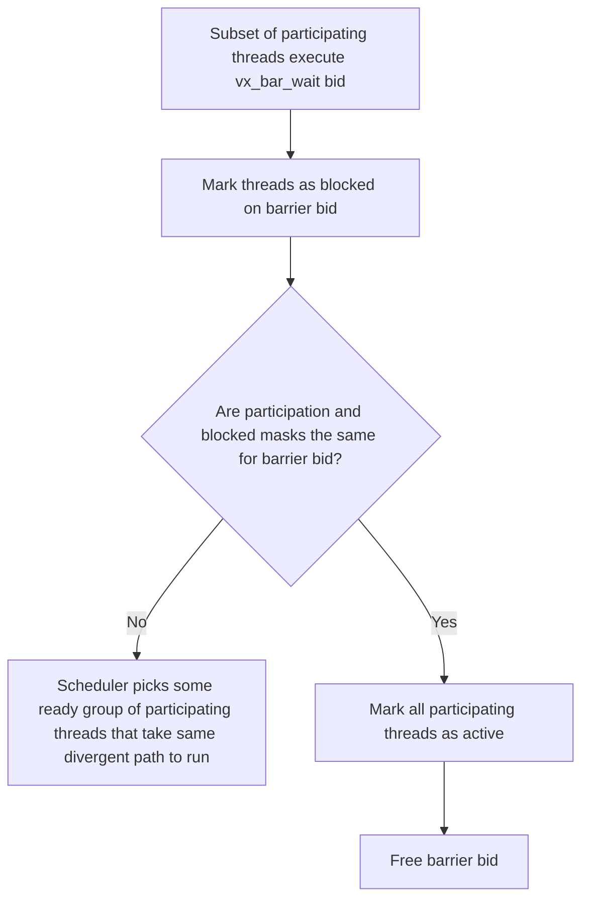

# Vortex Project: Independent Thread Scheduling
By Pritam Mukhopadhyaya

## 1. Introduction & Motivation

In pure SIMD there is only one active thread, so divergence is a non-issue. In pure MIMD threads are fully independent, so it is also a non-issue. GPUs, however, occupy the space between these two models under the SIMT approach. SIMT can be understood as a specialized form of MIMD where each thread maintains its own program counter (PC), but all threads of an active warp must share the same PC at any given cycle. This constraint makes thread-level divergence a first-class problem. When threads in a warp take different branch outcomes, parallelism breaks down as thread PCs disagree. The existing solution in the [Vortex GPGPU](https://github.com/vortexgpgpu/vortex) is the immediate post-dominator (IPDOM) stack: the compiler emits a `SPLIT` primitive before every divergent branch, pushing each path's thread mask and reconvergence point onto a per-warp stack, and a corresponding `JOIN` primtive to pop it on reconvergence. Under this model, a warp maintains a single PC and a single thread mask at all times, and divergent paths are strictly serialized: each path must run to completion before the other begins.

While full thread-level parallelism is unattainable under SIMT, the question this project asks is whether we can do better than strict serialization. Specifically, can divergent paths make interleaved progress, achieving concurrency rather than serialization? Concurrency is strictly preferable: it enables starvation-free execution that the IPDOM model cannot express. This motivation drove the development of indepdent thread scheduling (ITS), first proposed in an [NVIDIA patent](https://patents.google.com/patent/US20160019066A1/en) and first deployed commercially in the [Volta V100](https://images.nvidia.com/content/volta-architecture/pdf/volta-architecture-whitepaper.pdf). The key idea is to replace the per-warp stack with per-thread PCs and explicit barrier structures to orchestrate reconvergence. This comes with a scheduling cost: whereas the IPDOM model reads a mask from the top of the stack, ITS requires an active within-warp scheduler to determine which threads are runnable at each cycle.

This project implements ITS in Vortex as a replacement for the IPDOM stack in both the SimX functional simulator and the RTL, gated behind a build flag (`-DITS_ENABLE`). Correctness is currently verified on the existing [divergence regression test](https://github.com/vortexgpgpu/vortex/tree/master/tests/regression/diverge) using a binary patcher to inject the new ISA without compiler changes.

## 2. Implementation Details

### 2.1 ISA changes

ITS replaces the IPDOM ops with `vx_bar_add` and `vx_bar_wait` under opcode `CUSTOM0 = 0x0B`, `funct7 = 0`:

| Instruction | funct3 | Operands | Meaning |
|---|---|---|---|
| `vx_split / vx_join / vx_pred` | 2 / 3 / 5 | register predicate, mask, **stack token** | used for IPDOM divergence/reconvergence |
| `vx_bar_add  <bid>` | 6 | `bid` immediate (`rs1` field) | register active threads as participants of barrier `bid` |
| `vx_bar_wait <bid>` | 7 | `bid` immediate (`rs1` field) | arrive at `bid`; release all once **all** participants arrive |

### 2.2 Barrier semantics & reconvergence

`vx_bar_add <bid>`registers active threads as participants, then lets the scheduler run ready subsets (each taking the same path) until every subset has called `vx_bar_wait`. `vx_bar_wait <bid>` marks arriving threads as blocked and releases all participating threads once the blocked (arrival) set equals the participation set.





Unlike the ITS patent, we do not support yield or opt-out primitives, so diverging paths will still run until completion (no concurrency). The patent is vague about the scheduling policy (only describes behavior with yield and opt-out). The implemented scheduling policy takes a subset of particpants that have not yet arrived at the barrier with the smallest PC.

### 2.3 SimX implementation (`sim/simx`)

The ITS changes are gated behind `#ifdef ITS_ENABLE`, with the existing IPDOM code kept in the default build. Per-file changes:
| File | Change |
|---|---|
| `types.h` | `WctlType::BAR_ADD` / `BAR_WAIT`; `IntrWctlArgs.bid`; `NUM_ITS_BARRIERS = 32` |
| `decode.cpp` | decode `funct3` 6/7 (`bid` = rs1 field) |
| `emulator.h` / `emulator.cpp` | *(gated)* per-thread state + the within-warp scheduler in `Emulator::step()` |
| `execute.cpp` | *(gated)* divergent branches write per-thread PCs; `BAR_ADD`/`BAR_WAIT` maintain the participation/arrival masks; `TMC` drives `amask` |
| `func_unit.cpp` | `SfuUnit::tick()` handles `BAR_ADD`/`BAR_WAIT` as inline SFU control ops |

Per-warp data structures (`warp_t`, `emulator.h`):
| | State |
|---|---|
| **Added** (`#ifdef ITS_ENABLE`) | `tpc[]` (per-thread PC); `amask` (alive threads); `bar_participate[]` + `bar_arrived[]` (per-`bid` masks) |
| **Removable** (`#else`) | `ipdom_stack` + `ipdom_size_` |

### 2.4 RTL implementation (`hw/rtl`)

The same model in hardware, gated behind `` `ifdef ITS_ENABLE`` (default RTL keeps IPDOM). Per-file changes:
| File | Change |
|---|---|
| `VX_gpu_pkg.sv` | `INST_SFU_BAR_ADD`/`BAR_WAIT`, `NUM_ITS_BARRIERS = 32`, `its_bar_t`, 5-bit `bid` in `wctl_args_t` |
| `VX_decode.sv` | `funct3` 6/7 → `BAR_ADD`/`BAR_WAIT`; `bid` = rs1 field |
| `VX_branch_ctl_if.sv` + `VX_alu_int.sv` | per-thread branch: `taken_mask`, issued `tmask`, `ntaken_pc` from the per-lane compare bits |
| `VX_warp_ctl_if.sv` + `VX_wctl_unit.sv` | `its` payload `{valid, is_wait, bid, tmask}` + issue `pc`; bar ops always unlock the warp |
| `VX_schedule.sv` *(core)* | per-thread `thread_pcs`, `amask`, `its_part`/`its_arr`; issues the lowest-PC runnable group; branches write per-thread PCs; `bar_wait` releases when `its_arr == its_part`; SPLIT/JOIN no-op |

Per-warp data structures (`VX_schedule.sv`):
| | State |
|---|---|
| **Added** | `thread_pcs[w][t]` (replaces single `warp_pcs[wid]`); `amask[w][t]` (alive); `its_part`/`its_arr` `[w][bid][t]` (participation/arrival); control fields `branch_ctl_if.{taken_mask, tmask, ntaken_pc}`, `warp_ctl_if.{its, pc}` |
| **Removable** | `VX_ipdom_stack` + `VX_split_join`; single-PC `warp_pcs`; `thread_masks`; `branch_ctl_if.taken`, `split_t`/`join_t`, `dvstack_*` |

## 3. Evaluation & Results

### 3.1 Methodology

The ITS implementation is validated on exiting kernel we will refer to as the [diverge test](https://github.com/vortexgpgpu/vortex/tree/master/tests/regression/diverge). The diverge test inlcudes many high-level control flow constructs like nested if-else statements, loops, ternary expressions, and switch statements. It does not include divergence due to function pointers, however.

To run the diverge test kernel, no compiler or kernel source code changes were needed. Instead, manual patching of the kernel binary replaces `vx_split / vx_join / vx_pred` with `vx_bar_add / vx_bar_wait`. The patch is applied automatically during the build and hard-coded for this specific kernel:
```
  kernel.cpp
     |  clang (+vortex)      emits  vx_split / vx_join / vx_pred
     v
  kernel.elf
     |  its_patch.py         rewrites to  vx_bar_add / vx_bar_wait / nop
     v
  kernel.elf (patched)
     |  vxbin.py
     v
  kernel.vxbin ---------------+-------------------+
                              v                   v
                      SimX (-DITS_ENABLE)   rtlsim (-DITS_ENABLE)
```

### 3.2 Results

**Correctness.** The diverge test passes on both simulators with ITS, producing output identical to the host reference, when using the same hardware configuration and sweeping the workload size.

**Trace verification.** A SimX debug trace of one diverging 4-thread block shows ITS behaving exactly as intended (`tmask` = the active group):
```
PC=0x110  tmask=1111  BAR_ADD 0     all 4 threads register on barrier 0
PC=0x114  tmask=1111  BEQ ...       ordinary branch diverges the warp (no abort)
PC=0x118  tmask=0011  ...           group {0,1} runs one side (lowest PC first)
PC=0x138  tmask=1100  BAR_ADD 2     group {2,3} runs the other side, nested barrier
PC=0x170  tmask=0011  BAR_WAIT 0    {0,1} arrive at barrier 0 — not all → BLOCK
PC=0x170  tmask=0100  BAR_WAIT 0    {2} arrives later
PC=0x170  tmask=1000  BAR_WAIT 0    {3} arrives → union == 1111 → RELEASE ALL
PC=0x174  tmask=1111  ADDI ...      fully reconverged
```
This shows per-thread divergence at an ordinary branch, `bar_add` capturing each subgroup, and `bar_wait` holding until arrivals accumulate to the full participant.

**Performance (scaling study).** We fix the hardware at 1 core / 2 warps / 4 threads and scale the workload (`num_points` = 32, 64, 128, 256, 512) and observe IPC for both simulators:
| num_points | Instrs | SimX IPDOM | SimX ITS | rtlsim IPDOM | rtlsim ITS |
|---:|---:|---:|---:|---:|---:|
| 32  | 20.3k | 0.531 | **0.551** | 0.541 | **0.564** |
| 64  | 68.3k | 0.568 | **0.594** | 0.567 | **0.591** |
| 128 | 253k  | 0.586 | **0.619** | 0.576 | **0.606** |
| 256 | 979k  | 0.593 | **0.627** | 0.579 | **0.604** |
| 512 | 3.86M | 0.594 | **0.628** | 0.575 | **0.604** |

This shows ITS has higher IPC at every workload size for both simulators. We also observe that IPC rises with workload size due to fixed warp-spawn/setup cost amortization before saturating. The ITS advantage is likely a kernel-specific result. The clearest structural source is the divergent loop: IPDOM runs a fetch-stalling `vx_pred_n` every iteration to retire finished threads, whereas ITS replaces it with a plain `nop`. Reconvergence could also be cheaper (lowest-PC regrouping vs. a `JOIN` stack-pop + PCredirect).

## 4. Artifacts Evaluation

**Container.** The implementation is provided as a zip of the modified Vortex codebase with the
ITS changes applied (SimX, RTL, and the `tests/regression/diverge` patch tooling).

**Reproduce.** From the unzipped repo:

```bash
# one-time setup
mkdir build && cd build
../configure --xlen=64 --tooldir=$HOME/tools
./ci/toolchain_install.sh --all
source ./ci/toolchain_env.sh
# SimX with ITS  (the kernel is auto-patched to bar_add/bar_wait by the build)
CONFIGS="-DITS_ENABLE" ./ci/blackbox.sh --driver=simx \
    --cores=1 --warps=2 --threads=4 --app=diverge        # -> PASSED!
# rtlsim with ITS (the kernel is auto-patched)
CONFIGS="-DITS_ENABLE" ./ci/blackbox.sh --driver=rtlsim \
    --cores=1 --warps=2 --threads=4 --app=diverge        # -> PASSED!
```

**Inspect the patched binary.** After a normal (ITS) build, confirm/inspect the rewrite two ways:
```bash
# 1) patch report: "patched 0 sites" means the in-tree binary is already patched
python3 tests/regression/diverge/its_patch.py build/tests/regression/diverge/kernel.elf

# 2) disassembly: the bar ops show as raw <unknown> words (llvm-objdump has no
#    knowledge of the new ISA) and the removed loop guards as nop
make -C build/tests/regression/diverge kernel.dump
sed -n '/180000110:/,/180000174:/p' build/tests/regression/diverge/kernel.dump
#   180000110: 0b 60 00 00   <unknown>   # bar_add 0   ((0<<15)|0x600b)
#   180000170: 0b 70 00 00   <unknown>   # bar_wait 0  ((0<<15)|0x700b)
#   180000184: 13 00 00 00   nop         # removed loop guard
```

The SimX run log below renders the same words as `BAR_ADD` / `BAR_WAIT` (the simulator decodes the new ISA).
**Inspect the divergence trace**:

```bash
CONFIGS="-DITS_ENABLE" ./ci/blackbox.sh --driver=simx \
    --cores=1 --warps=1 --threads=4 --app=diverge --debug=3 --log=run.log
grep -E "BAR_ADD|BAR_WAIT" run.log
```

**Baseline (unpatched / IPDOM).** The diverge `Makefile` patches the kernel automatically, so to obtain the original `vx_split/join/pred` binary we can skip the patch step:
```bash
cd build/tests/regression/diverge
make clean
make kernel.elf      # compile + link; the patch rule has not run yet
touch .its_patched   # stamp newer than kernel.elf -> the patch step is skipped
make kernel.vxbin    # package the UNPATCHED elf
cd ../../..
# stock split/join kernel on the default (IPDOM) build -- no -DITS_ENABLE
./ci/blackbox.sh --driver=simx --cores=1 --warps=2 --threads=4 --app=diverge   # -> PASSED!
```
