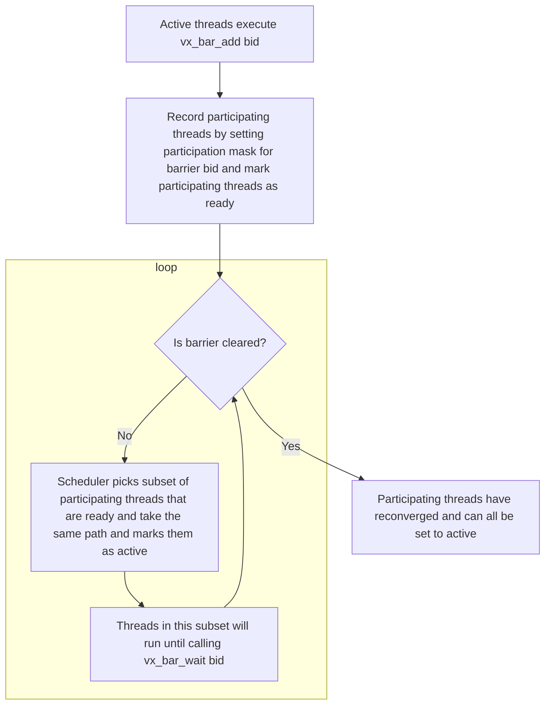
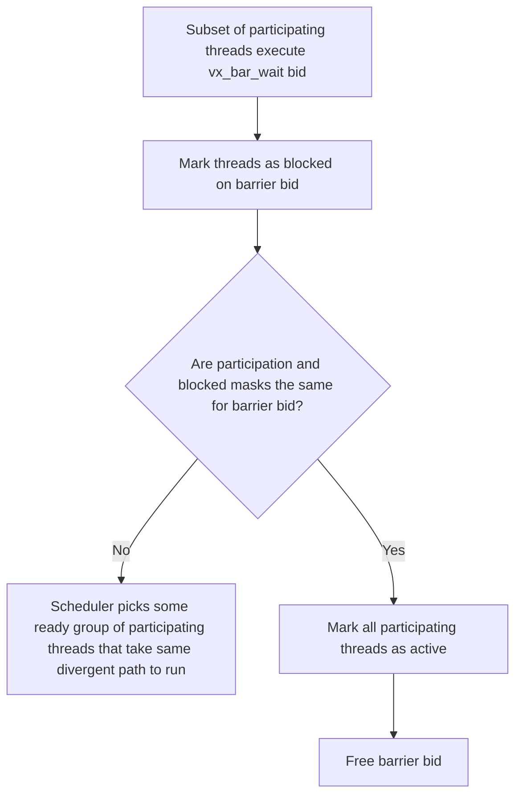

# `vx_bar_add` and `vx_bar_wait` Barrier Semantics

## Key Assumptions
It is not expected that we add support for yield/opt-out as suggested by the ITS patent patent. Because of this, divergent paths will still be serialized at path-level granularity rather than (potentially) instruction-level granularity.

## `vx_bar_add <bid>`



---

## `vx_bar_wait <bid>`



---

## Diff Explanation: `its_diverge.diff`

The diff transforms `build/tests/regression/diverge/kernel.dump` by replacing every `vx_split_n` / `vx_join` / `vx_pred_n` instruction with `vx_bar_add` / `vx_bar_wait`. The C++ source is `tests/regression/diverge/kernel.cpp`.

### Barrier-by-barrier breakdown

#### Barrier 0 - outer `if (task_id > 1)` diverge

```cpp
// kernel.cpp:41
if (task_id > 1) { ... } else { ... }
```

| Role | Addr | Old instruction | New instruction |
|------|------|-----------------|-----------------|
| `bar_add` | `0x180000110` | `vx_split_n a0, a1` | `vx_bar_add 0` |
| divergent branch | `0x180000114` | `beqz a1, 0x130` | *(unchanged)* |
| `bar_wait` | `0x180000170` | `vx_join a0` | `vx_bar_wait 0` |

`a1 = (task_id > 1)`.  Threads with `task_id > 1` fall through to `0x118`;
threads with `task_id <= 1` jump to `0x130`.  All paths reconverge at `0x170`.

---

#### Barrier 1 - inner `if (task_id > 2)` on the `task_id > 1` path

```cpp
// kernel.cpp:42  (only reached by threads where task_id > 1)
if (task_id > 2) { value += 6; } else { value += 5; }
```

| Role | Addr | Old instruction | New instruction |
|------|------|-----------------|-----------------|
| `bar_add` | `0x180000120` | `vx_split_n a1, a2` | `vx_bar_add 1` |
| divergent branch | `0x180000124` | `beqz a2, 0x14c` | *(unchanged)* |
| `bar_wait` | `0x18000016c` | `vx_join a1` | `vx_bar_wait 1` |

`a2 = (task_id == 2)` (i.e. `seqz` of `task_id − 2`). The `task_id == 2` path falls through to `0x128` and jumps to `0x16c`. The `task_id > 2` path goes to `0x14c` (which also merges the branchless "none-taken" logic - see [Compiler eliminations](#compiler-eliminations)) then falls into `0x16c`.

> **Note:** The compiler folds the `none-taken` section (`if (task_id >= 0x7fffffff)`)
> into this path using `czero.nez` / `czero.eqz` at `0x150–0x168` rather
> than emitting a separate split/join pair. No barrier is needed for that section.

---

#### Barrier 2 - inner `if (task_id > 0)` on the `task_id <= 1` path

```cpp
// kernel.cpp:47  (only reached by threads where task_id <= 1)
if (task_id > 0) { value += 4; } else { value += 3; }
```

| Role | Addr | Old instruction | New instruction |
|------|------|-----------------|-----------------|
| `bar_add` | `0x180000138` | `vx_split_n a1, a2` | `vx_bar_add 2` |
| divergent branch | `0x18000013c` | `beqz a2, 0x274` | *(unchanged)* |
| `bar_wait` (path A) | `0x180000144` | `vx_join a1` | `vx_bar_wait 2` |
| `bar_wait` (path B) | `0x180000278` | `vx_join a1` | `vx_bar_wait 2` |

`a2 = (task_id == 1)`.  The `task_id == 1` path reaches `bar_wait 2` at `0x144`. The `task_id == 0` path lands in the out-of-line block at `0x274` and reaches `bar_wait 2` at `0x278`. Both then jump to `0x170` (`bar_wait 0`).

The same `bid = 2` is reused at two physically different addresses because the hardware matches arrivals by barrier ID, not by instruction address.

---

#### Barrier 3 - `for`-loop `for (int i = 0, n = task_id; i < n; ++i)`

```cpp
// kernel.cpp:63
for (int i = 0, n = task_id; i < n; ++i) { value += src_ptr[i]; }
```

| Role | Addr | Old instruction | New instruction |
|------|------|-----------------|-----------------|
| `bar_add` | `0x18000017c` | `vx_split_n a1, a2` | `vx_bar_add 3` |
| divergent branch | `0x180000180` | `beqz a2, 0x1a8` | *(unchanged)* |
| *(loop entry)* | `0x180000184` | `csrr a2, tmask` | **removed** |
| *(loop guard)* | `0x1800001a0` | `vx_pred_n a4, a2` | **removed** |
| `bar_wait` | `0x1800001a8` | `vx_join a1` | `vx_bar_wait 3` |

This is the only section where ITS provides a structural simplification beyond a 1-for-1 swap.

In the stack-based model, `csrr a2, tmask` snapshots the current active-thread mask before the loop so that `vx_pred_n a4, a2` can retire individual threads from the warp as their iteration count `n = task_id` is exhausted.  Without this guard, a thread that finishes its `n` iterations would re-enter the loop body indefinitely.

With ITS, a thread that finishes simply executes `vx_bar_wait 3` and stalls. The scheduler continues running threads that still have iterations remaining. No mask snapshot or per-thread gate is required, so both instructions are deleted outright.

---

#### Barrier 4 - outer switch `if (task_id < 2)`

```cpp
// kernel.cpp:68  (compiler lowers switch to nested if-else tree)
switch (task_id) { case 0: ...; case 1: ...; case 2: ...; case 3: ...; }
// outer split: task_id < 2  vs.  task_id ≥ 2
```

| Role | Addr | Old instruction | New instruction |
|------|------|-----------------|-----------------|
| `bar_add` | `0x1800001b0` | `vx_split_n a1, a2` | `vx_bar_add 4` |
| divergent branch | `0x1800001b4` | `beqz a2, 0x1d0` | *(unchanged)* |
| `bar_wait` | `0x1800001f4` | `vx_join a1` | `vx_bar_wait 4` |

`a2 = (task_id < 2)`. Threads with `task_id < 2` go to `0x1b8` (barrier 5). Threads with `task_id >= 2` go to `0x1d0` (barrier 6). All reconverge at `0x1f4`.

---

#### Barrier 5 - inner switch `if (task_id < 1)` on `task_id < 2` path

```cpp
// cases 0 and 1 differentiated here
```

| Role | Addr | Old instruction | New instruction |
|------|------|-----------------|-----------------|
| `bar_add` | `0x1800001bc` | `vx_split_n a2, a3` | `vx_bar_add 5` |
| divergent branch | `0x1800001c0` | `beqz a3, 0x1ec` | *(unchanged)* |
| `bar_wait` | `0x1800001f0` | `vx_join a2` | `vx_bar_wait 5` |

`a3 = (task_id < 1)` --> `task_id == 0`.  The `task_id == 0` path (`value += 1`, case 0) falls through and joins at `0x1f0`. The `task_id == 1` path (`value −= 1`, case 1) jumps to `0x1ec` and also reaches `0x1f0`.

---

#### Barrier 6 - inner switch `if (task_id < 3)` on `task_id >= 2` path

```cpp
// cases 2 and 3/default differentiated here
```

| Role | Addr | Old instruction | New instruction |
|------|------|-----------------|-----------------|
| `bar_add` | `0x1800001d4` | `vx_split_n a2, a3` | `vx_bar_add 6` |
| divergent branch | `0x1800001d8` | `beqz a3, 0x280` | *(unchanged)* |
| `bar_wait` (path A) | `0x1800001e4` | `vx_join a2` | `vx_bar_wait 6` |
| `bar_wait` (path B) | `0x180000290` | `vx_join a2` | `vx_bar_wait 6` |

`a3 = (task_id < 3)` --> `task_id == 2`. The `task_id == 2` path (`value *= 3`) reaches `bar_wait 6` inline at `0x1e4`. The `task_id >= 3` (default) path lands in the out-of-line block at `0x280` and reaches `bar_wait 6` at `0x290`.  Both jump to `0x1f4` (`bar_wait 4`).

---

#### Barrier 7 - select `(task_id > 5) ? src_ptr[0] : task_id`

```cpp
// kernel.cpp:87
value += (task_id >= 0)                          // always true (uint32)
           ? ((task_id > 5) ? src_ptr[0] : task_id)
           : ...;
// compiler emits only the inner ternary:
```

| Role | Addr | Old instruction | New instruction |
|------|------|-----------------|-----------------|
| `bar_add` | `0x180000200` | `vx_split_n a1, a2` | `vx_bar_add 7` |
| divergent branch | `0x180000204` | `beqz a2, 0x20c` | *(unchanged)* |
| `bar_wait` | `0x18000020c` | `vx_join a1` | `vx_bar_wait 7` |

`a2 = (task_id > 5)`. Threads with `task_id > 5` load `src_ptr[0]` at `0x208` before reaching `bar_wait 7`; threads with `task_id ≤ 5` skip directly to `bar_wait 7` at `0x20c`.

---

### Compiler eliminations

Two seemingly divergent C++ constructs emit no split/join/barrier instructions at all because the compiler recognized divergence does not actually occur.

**1. `none-taken` section - `if (task_id >= 0x7fffffff)`** (kernel.cpp:34)

The compiler merges this into the `task_id > 2` diverge path using conditional-zero instructions (`czero.nez` / `czero.eqz` at `0x15c–0x168`).  Every thread executes the same arithmetic. The condition selects which result to keep.

**2. `all-taken` section - `if (task_id >= 0)`** (kernel.cpp:56)

`task_id` is `uint32_t`, so `task_id >= 0` is always true. The compiler folds `value += 7` (the true branch) into a single `addi a0, s7, 0x7` at `0x174` and discards the  false branch.

**3. Hacker-loop inner conditional - `if ((key.user & 0x1) == 0)`** (kernel.cpp:28)

The loop body is compiled branchlessly:
```asm
1800000f4: lw   a0, 0x4(sp)    # a0 = key.user
1800000f8: not  a0, a0          # a0 = ~key.user
1800000fc: andi a0, a0, 0x1    # a0 = 1 if even, 0 if odd
180000100: add  s7, a0, s7     # value += result
```
The loop back-edge (`bnez s8, 0x1800000e4`) is uniform - every thread shares the same `samples = arg->num_points` so no divergence occurs.